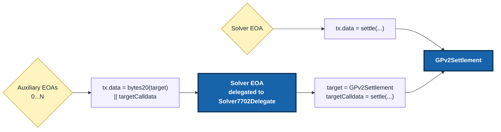

# Solver7702Delegate

`Solver7702Delegate` is a minimal ERC-7702 delegation target for CoW Protocol solvers. It enables parallel settlement submission through auxiliary EOAs without changing the allowlisted solver identity.

## Usage

> [!WARNING]
> Approved auxiliary EOAs are trusted hot keys. They can make arbitrary calls as the solver EOA, so keep solver EOA balances and approvals minimal.

### How it works

Use direct submission while the solver EOA is free. If it already has a pending transaction, an auxiliary EOA can submit through a separate nonce lane.



The auxiliary EOA sends the transaction to the solver EOA, not to the delegate contract. The solver EOA's ERC-7702 delegation runs `Solver7702Delegate` at the solver EOA address.

Inside `Solver7702Delegate`, `msg.sender` is the auxiliary EOA and `address(this)` is the solver EOA. Inside `GPv2Settlement`, `msg.sender` is still the solver EOA.

The delegate expects packed calldata: `abi.encodePacked(bytes20(target), targetCalldata)`. Do not use `abi.encode(target, targetCalldata)`.

### Deploy

The deploy script reads up to five approved caller addresses from `APPROVED_CALLERS`. If fewer than five addresses are needed, omit the rest.

```shell
export APPROVED_CALLERS=<approved_caller_0>,<approved_caller_1>

forge script script/DeploySolver7702Delegate.s.sol:DeploySolver7702Delegate \
  --rpc-url <your_rpc_url> \
  --private-key <your_private_key>
```

This command performs a dry run. Review the result, then run it again with `--broadcast` to deploy the contract.

Deployments use `CREATE2` with a zero salt by default. To use a different salt, set `SALT` before running the deploy command:

```shell
export SALT=<bytes32_salt>
```

### Add or replace delegation

After deployment, the solver EOA must authorize the delegate address.

The examples use `--private-key`, but `cast` also supports keystores, hardware wallets, and cloud KMS signers. Run `cast wallet sign-auth --help` to see the options supported by your Foundry version.

**Use `--self-broadcast` only when the solver EOA signs the authorization and also sends the transaction.**

When the solver EOA both signs the authorization and sends the transaction:

```shell
signed_auth=$(cast wallet sign-auth <delegate_address> \
  --private-key <solver_private_key> \
  --rpc-url <rpc_url> \
  --chain <chain_id> \
  --self-broadcast)

cast send 0x0000000000000000000000000000000000000000 \
  --auth ${signed_auth} \
  --private-key <solver_private_key> \
  --rpc-url <rpc_url> \
  --chain <chain_id>
```

**If the solver EOA sends the transaction and the authorization was signed without `--self-broadcast`, the transaction can succeed while the authorization is not applied.** In that case, `cast code <solver_eoa>` will still return `0x`.

If another funded account sends the authorization transaction, the solver EOA still needs to sign the authorization. Omit `--self-broadcast`, then pass the sender's key to `cast send` as `--private-key <transaction_sender_private_key>`.

### Verify delegation

Check the solver EOA code:

```shell
cast code <solver_eoa> --rpc-url <rpc_url>
```

For ERC-7702 delegation, the code should be:

```text
0xef0100 || delegate_address
```

On a block explorer:

1. Open the solver EOA. It may not have a normal contract code view. Confirm that its **Delegated to** banner points to the expected delegate address.
2. Open the linked delegate address. Its **Contract** or **Code** tab must show verified source code that matches [`Solver7702Delegate`](./src/Solver7702Delegate.sol).
3. Under **Constructor Arguments**, decode `approvedCallers` as `address[5]` and compare all five entries with the intended auxiliary EOAs. Unused entries should be the zero address.

You can also open the delegation transaction and check its **Authorizations** tab. It should identify the solver EOA, the expected delegated address, and a valid authorization.

### Send a delegated call manually

The reference driver sends delegated calls automatically. Use this command only for manual testing or a custom integration:

```shell
cast send <solver_eoa> $(cast concat-hex <target_address> <original_call_data>) \
  --private-key <auxiliary_private_key> \
  --rpc-url <rpc_url> \
  --chain <chain_id>
```

### Replace callers

The caller set is immutable. To change it, repeat the [deploy process](#deploy) with the new callers, then [authorize the new delegate](#add-or-replace-delegation).

The old contract remains on-chain but has no power over the solver EOA once delegation points to the new contract.

### Revoke delegation

To stop using the current delegate, have the solver EOA authorize the zero address.

Use the same [`--self-broadcast` rule](#add-or-replace-delegation) as when adding delegation.

```shell
signed_auth=$(cast wallet sign-auth 0x0000000000000000000000000000000000000000 \
  --private-key <solver_private_key> \
  --rpc-url <rpc_url> \
  --chain <chain_id> \
  --self-broadcast)

cast send 0x0000000000000000000000000000000000000000 \
  --auth ${signed_auth} \
  --private-key <solver_private_key> \
  --rpc-url <rpc_url> \
  --chain <chain_id>
```

Then verify that `cast code <solver_eoa>` no longer points to the previous delegate, using the [same verification method as before](#verify-delegation).

## Development

### Just commands

Install `just` on your machine, then run `just help` to see the available commands.

### Build

```shell
just build
```

Project contracts should keep simple caret pragmas like `^0.8` so downstream projects can import them with older compatible Solidity 0.8 compilers.

If specific features are needed (like PUSH0 in 0.8.20 for gas optimizations or transient storage/better `via-ir` in 0.8.34), you can use it but make sure to keep the caret (`^`).

### Test

```shell
just test
```

#### Replaying Your Own Historical Transactions

The fork test `test_fork_historicalTransaction_directVsDelegated_userSuppliedTxHashes` lets you replay your own batch transactions through the delegate.

Set:

- `FORK_RPC_URL` to the RPC URL you want Foundry to fork from.
- `COW_HISTORICAL_TX_HASHES` to a comma-separated list of transaction hashes.

The supplied transaction hashes just need to exist on that network, and the RPC must support the historical state needed by `vm.rollFork(txHash)`.

Example:

```shell
FORK_RPC_URL=<your_rpc_url> \
COW_HISTORICAL_TX_HASHES=0xabc...,0xdef... \
just test --match-test test_fork_historicalTransaction_directVsDelegated_userSuppliedTxHashes
```

### Format

```shell
just fmt
```

### Local tooling

Foundry should be installed locally and pinned to `v1.7.1`. CI uses the same Foundry version.

Install Foundry with:

```shell
foundryup --install v1.7.1
```

Check that the expected version is active with:

```shell
forge --version
```

The output should end in `v1.7.1`.

Solhint and Slither are pinned as local development dependencies under `dev/`.

The pnpm and uv setups wait 7 days before installing newly released packages, matching CoW repos and giving more review time than a 2-day delay.

Install them with:

```shell
pnpm --dir dev install --frozen-lockfile
uv sync --project dev --locked
```

Run the pinned local tools through `just`. `just lint` checks Forge formatting and Solhint, and `just slither` checks contracts under `src`.

```shell
just lint
just slither
```

### Pre-commit hooks

Install the hooks with:

```shell
just register-hooks
```

The pre-push hooks run `just lint`, `just slither`, and `just coverage-check`.
You can bypass hooks with `--no-verify`, but CI remains the source of truth.

The root config applies to all Solidity files.
The `script/` and `test/` folders have a small override config for their own style.

### Gas Snapshots

```shell
just snapshot
```

## More docs

The external solver guide is available at https://docs.cow.fi/cow-protocol/tutorials/solvers/solver-7702-delegate
