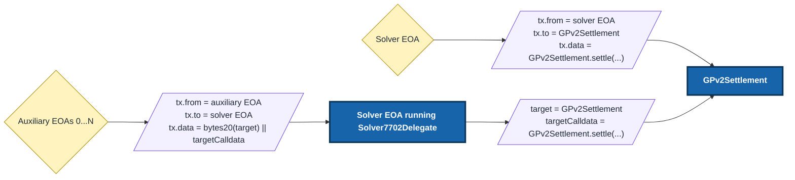

# Solver7702Delegate

`Solver7702Delegate` is a minimal ERC-7702 delegation target for CoW Protocol solvers. It lets a solver keep using its existing solver EOA while allowing a fixed set of auxiliary EOAs to submit transactions through that solver EOA. The main benefit is parallel settlement submission: auxiliary EOAs provide independent nonce lanes, while downstream contracts still see the solver EOA as `msg.sender`.

Read more about the initiative [here](https://www.notion.so/cownation/Solver7702Delegate-Design-Doc-3588da5f04ca80a1b521c436abf17724).

**Important:** approved auxiliary EOAs are trusted hot keys. They can make arbitrary calls as the solver EOA, so keep solver EOA balances and approvals minimal.

## How it works

Direct submission is still valid and should be used when the solver EOA is free. Delegated submission is useful when the solver EOA already has a pending settlement and another settlement should be submitted through a different nonce lane.



Inside the `Solver7702Delegate`, `msg.sender` is the auxiliary EOA and `address(this)` is the solver EOA. However, once the call reaches `GPv2Settlement`, `msg.sender` is still the solver EOA.

The calldata format is packed on purpose. Use `abi.encodePacked(bytes20(target), targetCalldata)`. Do not use `abi.encode(target, targetCalldata)`.

## Security considerations

An approved auxiliary EOA can make arbitrary calls as the solver EOA. This can move ETH or tokens held by the solver EOA, set approvals, or call other contracts.

Do not share auxiliary EOAs across solvers. Monitor auxiliary keys and rotate them immediately if one is compromised.

Changing the auxiliary caller set requires deploying a new `Solver7702Delegate` and updating the solver EOA's ERC-7702 delegation.

## Operator setup

### Deploy

The deploy script reads up to five approved caller addresses from `APPROVED_CALLERS`. If fewer than five addresses are needed, omit the rest.

```shell
export APPROVED_CALLERS=<approved_caller_0>,<approved_caller_1>

just forge script script/DeploySolver7702Delegate.s.sol:DeploySolver7702Delegate \
  --rpc-url <your_rpc_url> \
  --private-key <your_private_key> \
  --broadcast
```

Deployments use `CREATE2` with a zero salt by default. To use a different salt, pass a `bytes32` value:

```shell
export SALT=<bytes32_salt>

just forge script script/DeploySolver7702Delegate.s.sol:DeploySolver7702Delegate \
  --rpc-url <your_rpc_url> \
  --private-key <your_private_key> \
  --broadcast
```

To simulate the deployment and inspect the computed address, run the same command without `--broadcast`:

```shell
just forge script script/DeploySolver7702Delegate.s.sol:DeploySolver7702Delegate \
  --rpc-url <your_rpc_url> \
  --private-key <your_private_key>
```

This is only a dry run. It prints the address that would be used, but it does not deploy the contract.

### Add delegation

After deploying the delegate, the solver EOA must sign an ERC-7702 authorization for the delegate address.

The transaction that carries the authorization can be submitted by any funded account. `<signed_authorization>` below is the output from the previous `cast wallet sign-auth` command.

The examples use `--private-key`, but you can use any wallet signing option supported by your `cast` version, such as a keystore, hardware wallet, or cloud KMS signer. Run `cast wallet sign-auth --help` for the exact options available in your local Foundry version.

**Use `--self-broadcast` only when the solver EOA signs the authorization and also sends the transaction.**

#### Authorization sent by the solver EOA

Use `--self-broadcast` when signing:

```shell
cast wallet sign-auth <delegate_address> \
  --private-key <solver_private_key> \
  --rpc-url <rpc_url> \
  --chain <chain_id> \
  --self-broadcast
```

Then submit the transaction from the solver EOA:

```shell
cast send 0x0000000000000000000000000000000000000000 \
  --auth <signed_authorization> \
  --private-key <solver_private_key> \
  --rpc-url <rpc_url> \
  --chain <chain_id>
```

**If the solver EOA sends the transaction and the authorization was signed without `--self-broadcast`, the transaction can succeed while the authorization is not applied.** In that case, `cast code <solver_eoa>` will still return `0x`.

#### Authorization sent by a different funded account

Do not use `--self-broadcast` in this case:

```shell
cast wallet sign-auth <delegate_address> \
  --private-key <solver_private_key> \
  --rpc-url <rpc_url> \
  --chain <chain_id>
```

Then submit a zero-value transaction with the signed authorization:

```shell
cast send 0x0000000000000000000000000000000000000000 \
  --auth <signed_authorization> \
  --private-key <transaction_sender_private_key> \
  --rpc-url <rpc_url> \
  --chain <chain_id>
```

### Verify delegation

Check the solver EOA code:

```shell
cast code <solver_eoa> --rpc-url <rpc_url>
```

For ERC-7702 delegation, the code should be:

```text
0xef0100 || delegate_address
```

Also verify the deployed delegate runtime bytecode against the expected artifact and approved caller set. The approved callers are immutable values, so each caller set can produce different runtime bytecode.

### Submit through the delegate

Auxiliary EOAs submit calls to the solver EOA. The calldata must be:

```text
bytes20(target) || targetCalldata
```

For settlements, `target` is `GPv2Settlement` and `targetCalldata` is the normal `settle(...)` calldata.

Simulate the exact delegated transaction shape before submitting:

```text
from = auxiliary EOA
to   = solver EOA
data = bytes20(GPv2Settlement) || GPv2Settlement.settle(...)
```

### Replace callers

Approved callers cannot be changed in place. If you need to change any authorized auxiliary account, re-do the [deploy process](#deploy) with the new caller set and then [add delegation](#add-delegation) again.

The old delegate contract remains on-chain, but it has no power unless a solver EOA delegates to it.

### Revoke delegation

To clear delegation, have the solver EOA sign an ERC-7702 authorization to the zero address.

**Use the same [`--self-broadcast` rule](#add-delegation) as when adding delegation: add it only when the solver EOA signs and sends the revoke transaction.**

If the solver EOA submits its own revoke transaction, add `--self-broadcast`:

```shell
cast wallet sign-auth 0x0000000000000000000000000000000000000000 \
  --private-key <solver_private_key> \
  --rpc-url <rpc_url> \
  --chain <chain_id> \
  --self-broadcast

cast send 0x0000000000000000000000000000000000000000 \
  --auth <signed_authorization> \
  --private-key <solver_private_key> \
  --rpc-url <rpc_url> \
  --chain <chain_id>
```

If a different funded account submits the revoke transaction, do not use `--self-broadcast`:

```shell
cast wallet sign-auth 0x0000000000000000000000000000000000000000 \
  --private-key <solver_private_key> \
  --rpc-url <rpc_url> \
  --chain <chain_id>

cast send 0x0000000000000000000000000000000000000000 \
  --auth <signed_authorization> \
  --private-key <transaction_sender_private_key> \
  --rpc-url <rpc_url> \
  --chain <chain_id>
```

Then verify that `cast code <solver_eoa>` no longer points to the previous delegate. Revoking to the zero address does not necessarily return the account to empty code; it can leave the account delegated to the zero address.

## Development

### Just commands

Install `just` on your machine, then run `just help` to see the available commands.

### Build

```shell
just build
```

Project contracts should keep simple caret pragmas like `^0.8` so downstream projects can import them with older compatible Solidity 0.8 compilers.

If specific features are needed (like PUSH0 in 0.8.20 for gas optimizations or transient storage/better `via-ir` in 0.8.34), you can use it but make sure to keep the caret (`^`).

### Test

```shell
just test
```

#### Replaying Your Own Historical Transactions

The fork test `test_fork_historicalTransaction_directVsDelegated_userSuppliedTxHashes` lets you replay your own batch transactions through the delegate.

Set:

- `FORK_RPC_URL` to the RPC URL you want Foundry to fork from.
- `COW_HISTORICAL_TX_HASHES` to a comma-separated list of transaction hashes.

The supplied transaction hashes just need to exist on that network, and the RPC must support the historical state needed by `vm.rollFork(txHash)`.

Example:

```shell
FORK_RPC_URL=<your_rpc_url> \
COW_HISTORICAL_TX_HASHES=0xabc...,0xdef... \
just test --match-test test_fork_historicalTransaction_directVsDelegated_userSuppliedTxHashes
```

### Format

```shell
just fmt
```

### Local tooling

Foundry should be installed locally and pinned to `v1.7.1`. CI uses the same Foundry version.

Install Foundry with:

```shell
foundryup --install v1.7.1
```

Check that the expected version is active with:

```shell
forge --version
```

The output should end in `v1.7.1`.

Solhint and Slither are pinned as local development dependencies under `dev/`.

The pnpm and uv setups wait 7 days before installing newly released packages, matching CoW repos and giving more review time than a 2-day delay.

Install them with:

```shell
pnpm --dir dev install --frozen-lockfile
uv sync --project dev --locked
```

Run the pinned local tools through `just`. `just lint` checks Forge formatting and Solhint, and `just slither` checks contracts under `src`.

```shell
just lint
just slither
```

### Pre-commit hooks

Install the hooks with:

```shell
just register-hooks
```

The pre-push hooks run `just lint`, `just slither`, and `just coverage-check`.
You can bypass hooks with `--no-verify`, but CI remains the source of truth.

The root config applies to all Solidity files.
The `script/` and `test/` folders have a small override config for their own style.

### Gas Snapshots

```shell
just snapshot
```

## More docs

The external solver guide is available at https://docs.cow.fi/cow-protocol/tutorials/solvers/solver-7702-delegate
